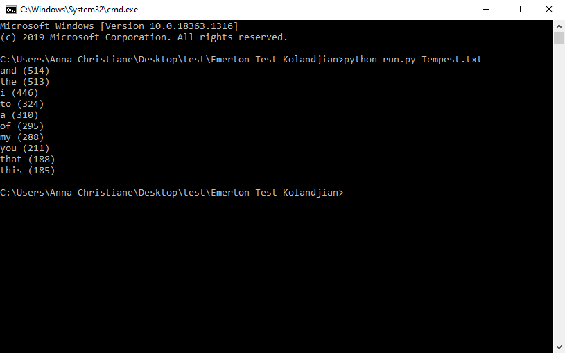

# Word Frequency Counter

[](https://www.ackolandjian.tk)

Authors:
 - Anna Christina Kolandjian
 
# 🎯 Goal
This program counts unique words from an English text file, treating hyphen and apostrophe 
as part of the word. It prints the ten most frequent words and mentions the number of 
occurrences.

# 📝 Description 
It takes the content of the text file passed and produces a dictionary
containing the word as a key and the individual word count as a value.

The output is in the format:

```bash
and (514)
the (513)
i (446)
to (324)
a (310)
of (295)
my (288)
you (211)
that (188)
this (185)
```

# 💻 Software Development
### File Hierarchy
```
wordCount
├── run.py
├── wordcount.py
├── processtext.py
├── Tempest.txt
├── img
│ ├── logo.png
│ └── expected-output.png
│ 
└── README.md
```
### Development

- run.py: 
   - Takes the input file path, if it's given by the user in the command, else asks for an input file path.
   - Calls the primary method of wordcount.py: get.result() 
- wordcount.py:
   - Once its primary method get.result() is called, it validates the file path (if it's not valid, it asks for a new one). 
   - It splits the whole content of the text file by empty spaces and return it as a list of strings.
   - Calls the processtext.py method get.dict() to get the dictionary.
- processtext.py:
   - It takes the content of the file (list of strings) passed and produces a dictionary containing words as keys and individual word counts as values.
   - The dictionary is returned to the caller (wordcount.py).

# ⚠️ Note to Users

There are special cases which are probably covered in this program.

For example: any word with an apostrophe (like "Fred's") is counted as a part of the word (i.e. it is considered as "Fred's" and not "Fred") whereas different forms of the same word (like "fly", "flying", "flew") count as different words.
Another example: any word containing a hyphen (like "you-") is counted as a part of the word (i.e. it is considered as "you-" and not "you").

# ❓ How To Use

* 🏃 Execute run.py
```bash
$ python3 run.py <input file>
```
In our case:
```bash
$ python3 run.py Tempest.txt
```
* 🏁 Expected output

]

# 📃 License

Licensed under ACK ©2021. See the license for the details.
